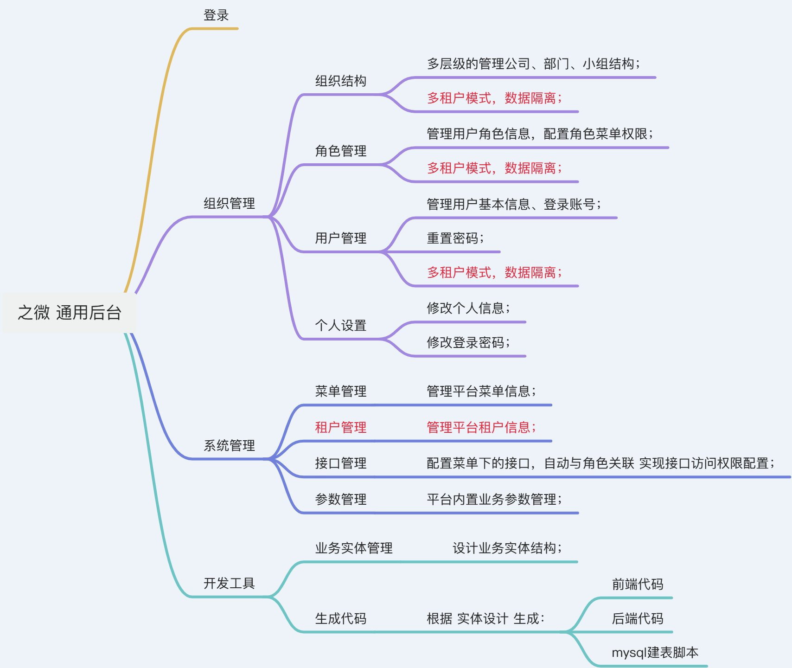
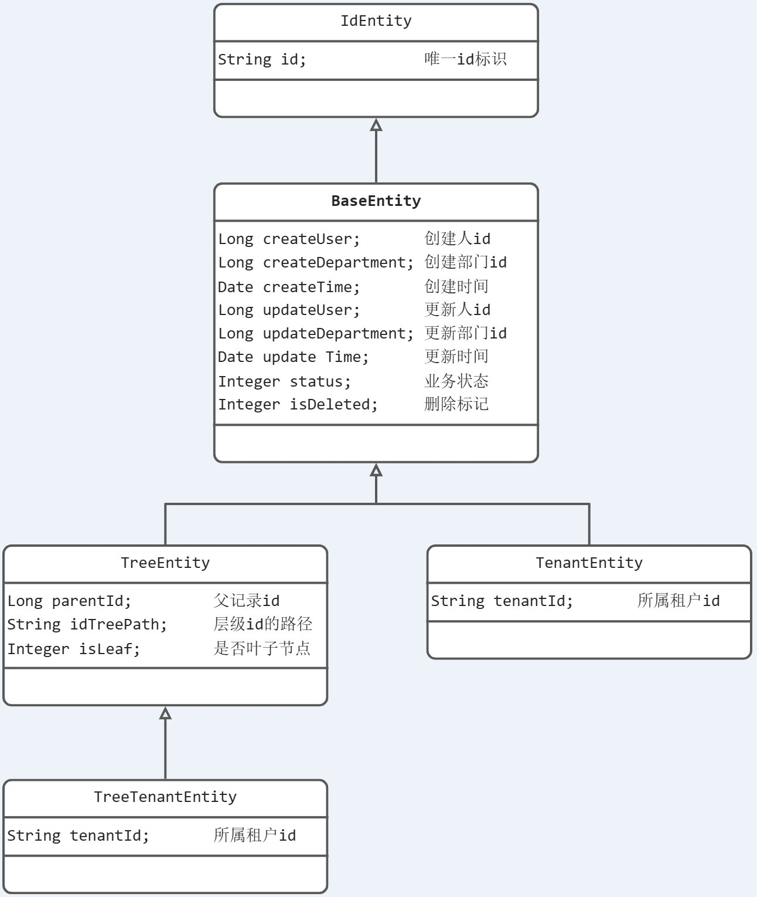
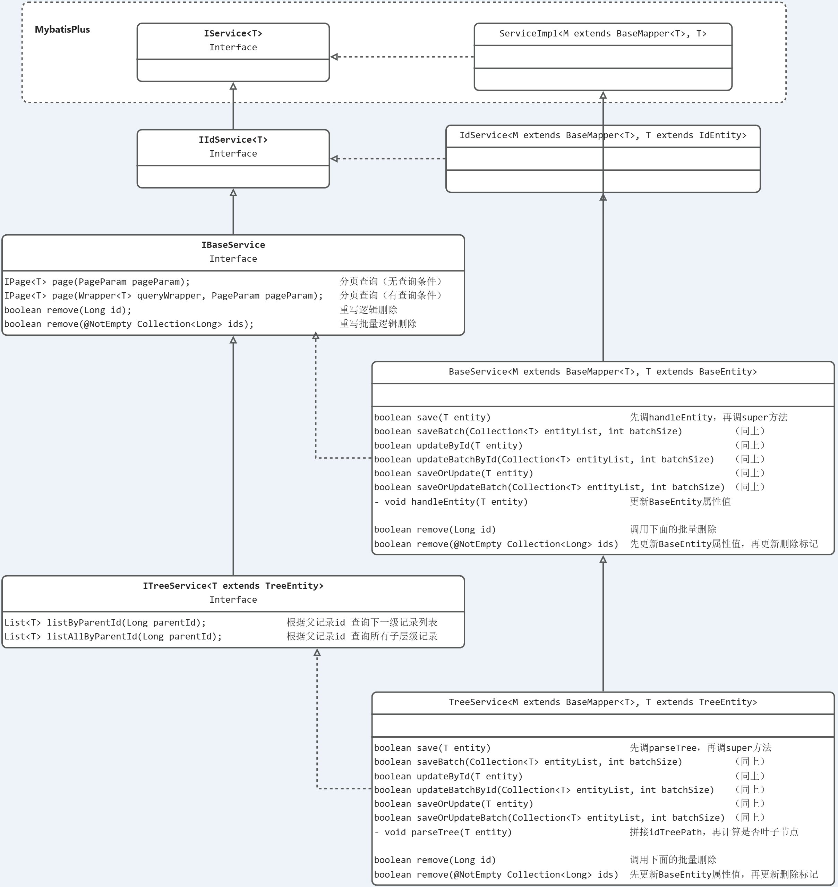
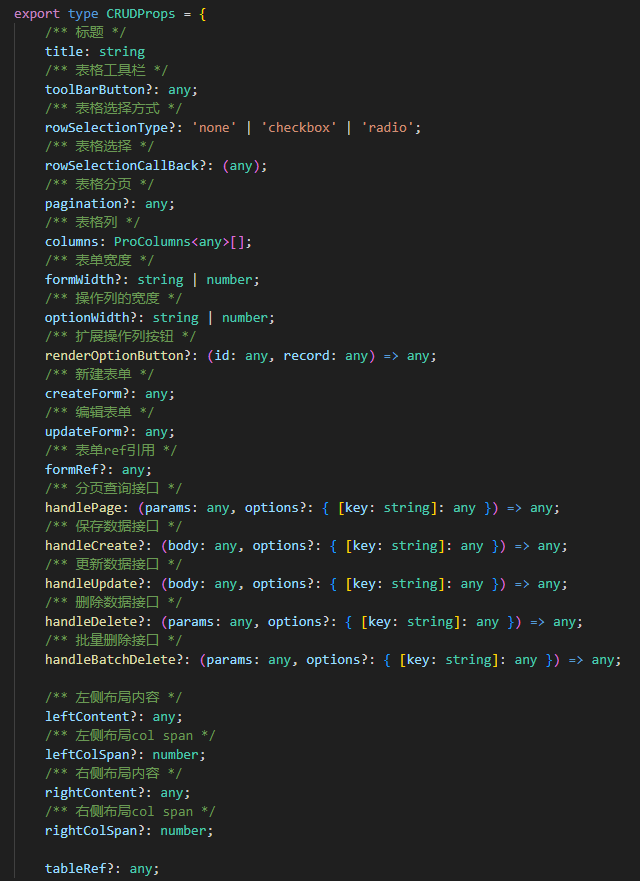
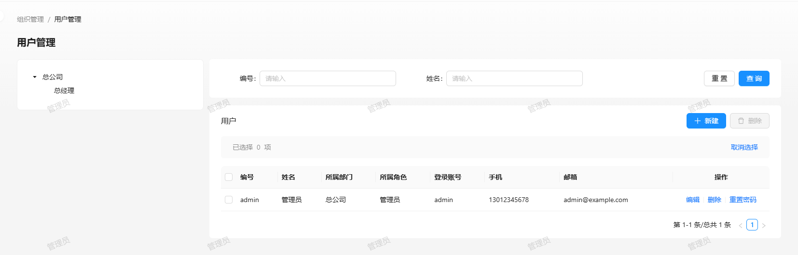

# 之微

旨在搭建一个轻量、灵活的通用后台管理系统，以适应快速、多变的业务发展场景；

v0.9 重构版开发中，采用可视化配置 支持更多、更灵活的集成流程；

详见 [原型设计](https://modao.cc/proto/GCMFOyksl6fbgVtFwEKwq)

-------------------------------------------------------------------------------

## 介绍



## 原型设计

原型设计，详见墨刀：https://modao.cc/community/mtm06isnlsznhm9c

## 系统结构

* 前后端分离
    * 前端项目：代号 [**鹘鹰**(Gyrfalcon)](https://gitee.com/LIEN321/zhiwei_Gyrfalcon)，基于最新版的Ant Design Pro
      v6，提供简约、方便的体验；
    * 后端项目：代号 [**寒铁**(FrostMetal)](https://gitee.com/LIEN321/zhiwei_FrostMetal)，基于最新版的SpringBoot
      v3，提供安全、稳定的服务；


* 技术选型

| 分类  | 名称                      | 版本号     | 说明             |
|-----|-------------------------|---------|----------------|
| 前端  | antdesign pro           | 6.0.0   | 前端脚手架          |
|     | node.js                 | 20.17.0 | 前端运行环境         |
|     | npm                     | 10.8.2  | node包管理器       |
|     | nginx                   | latest  | 前端web服务器       |
| 后端  | jdk                     | 17      | Java开发工具包      |
|     | spring boot             | 3.3.3   | 后端框架           |
|     | hutool                  | 5.8.31  | Java工具包类库      |
|     | sa token                | 1.38.0  | 权限认证           |
|     | knife4j                 | 4.4.0   | 集成Swagger的增强工具 |
| 数据库 | mysql                   | 8.x     | 数据库            |
|     | mysql-connector-j       | 8.4.0   | mysql驱动        |
|     | druid                   | 1.2.23  | 数据库连接池         |
|     | mybatis-plus            | 3.5.7   | Java持久层框架      |
| 缓存  | redis                   | latest  | 缓存服务           |
| 编译  | maven                   | 3.9.9   | 编辑构建工具         |
| 部署  | docker & docker-compose | 20.0.1  | 容器化部署和运行服务     |

## 工程结构

```
zhiwei_FrostMetal 
├-- src/main/java/tech/zhiwei
├    ├-- frostmetal    -- 框架根目录
├--  ├--  ├-- auth       -- 授权模块（token校验、api权限）
├--  ├--  ├-- cache      -- 缓存模块
├--  ├--  ├-- core       -- 核心模块：通用基础类、常量、组件配置等
├--  ├--  ├-- dev        -- 开发工具模块，生成代码
├--  ├--  ├-- modules    -- 业务模块包
├--  ├--  ├-- portal     -- 门户通用模块
├--  ├--  ├-- system     -- 系统管理模块
├    ├── tool          -- 工具类（继承hutool为主，再扩展）
```

## 后端主要类图

* Entity实体类结构
  

* Service类结构
  

## 前端主要组件

* CRUD

  作用：封装基本的增删改查，减少冗余代码；

  布局：左（自定义，可空）、中（表格）、右（自定义，可空）

  表格：ProTable，表单：ModalForm + 自定义组件

  组件属性：
  

  示例：用户管理
  
  代码片段如下：可详见 [用户管理界面](https://gitee.com/LIEN321/zhiwei_Gyrfalcon/blob/dev/src/pages/Organization/User/User.tsx)

```js
<CRUD
    tableRef={tableRef}
    // 标题
    title="用户
    // 表格列
    columns={columns}
    // 表格最右 操作列的宽度
    optionWidth={200}
    // 表格最有 扩展的按钮
    renderOptionButton={renderOptionButton}
"
    // 表单宽度
    formWidth={800}
    // 自定义的新建表单
    createForm={renderUserForm(true)}
    // 自定义的更新表单
    updateForm={renderUserForm(false)}
    
    // 表格分页数据
    handlePage={(params, options) => {
        params.departmentId = departmentId;
        return userPage(params, options);
    }}
    
    // 提交新增时的操作 
    handleCreate={saveUser}
    // 提交更新时的操作
    handleUpdate={saveUser}
    // 删除单个数据的操作
    handleDelete={deleteUser}
    // 批量删除的操作
    handleBatchDelete={deleteUsers}

    // 表格左侧扩展内容
    leftContent={departmentTreeCard}
    // 左侧的布局宽度
    leftColSpan={6}
/>
```

## 联系方式

vx：lient321，欢迎咨询和反馈！

## 更新日志

## 0.1.4

### 新功能

- 增加多租户模式；

    - 系统管理，增加租户管理模块；

    - 组织结构、开发工具模块 接入所属租户，按租户分隔；

    - 登录界面，增加租户编号的输入框；

- 生成代码
    - 继承模式增加 TenantEntity 选项，且为默认选项；

### 优化

- 后端框架

    - 用户登录成功后，根据角色缓存可见菜单列表，减少查询；

    - 用户登录成功后，改用sa的session储存用户基本信息，减少查询；

### 修复

- 生成代码
    - 修复属性列表页无法生成代码问题；

## 0.1.3（2024-10-13）

### 新功能

- 开发工具

    - 生成mysql的建表脚本；

    - 批量生成，选择多个实体生成所有代码和脚本；

### 优化

- 前端框架
    - 更新ant design pro框架至2024-10-09的最新代码；

### 修复

- 修改密码
    - 修复设置复杂密码后 强度不显示问题；

## 0.1.2（2024-10-10）

### 新功能

- 开发工具
    - 生成代码，通过登记数据模型 生成前后端的增删改查代码；

### 优化

- 用户管理
    - 用户列表页 表格左侧增加部门树，以便按部门查看用户；

- 支持docker部署
    - 增加dockerfile、nginx.conf等配置文件；

- 前端框架
    - 优化CRUD组件：
        - 扩展左中右布局；
        - 增加tableRef，以便外部刷新表格；

- 后端框架
    - 日志输出配置区分dev和prod环境；

## 0.1.1（2024-09-19）

### 新功能

- 可配置的接口访问权限
    - 系统管理：增加接口管理模块；

- 菜单图标支持选择
    - 系统管理/菜单管理：增加“选择图标”组件；

- 管理员可重置用户的登录密码
    - 组织管理/用户管理：增加“重置密码”功能；

- 前端框架
    - 封装“Icon列表”组件；

- 后端框架

    - 接口权限的拦截校验；

    - 集成Redis；

### 优化

- 菜单数据 存入缓存

    - 菜单管理的菜单列表 存入缓存；
        - 更新菜单后更新缓存；

    - 用户登录后的可见菜单 存入缓存；
        - 退出登录时 删除缓存；

- 部门数据 存入缓存
- SA-Token 对接Redis缓存；

## 0.1.0（2024-09-02）

### 新功能

- 账号登录

- 系统管理

    - 菜单管理

    - 参数管理

- 组织管理

    - 组织结构

    - 角色管理

    - 用户管理

    - 个人设置

        - 基本设置

        - 安全设置